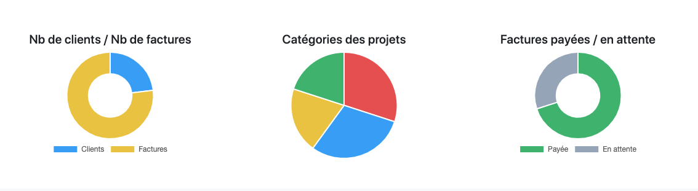
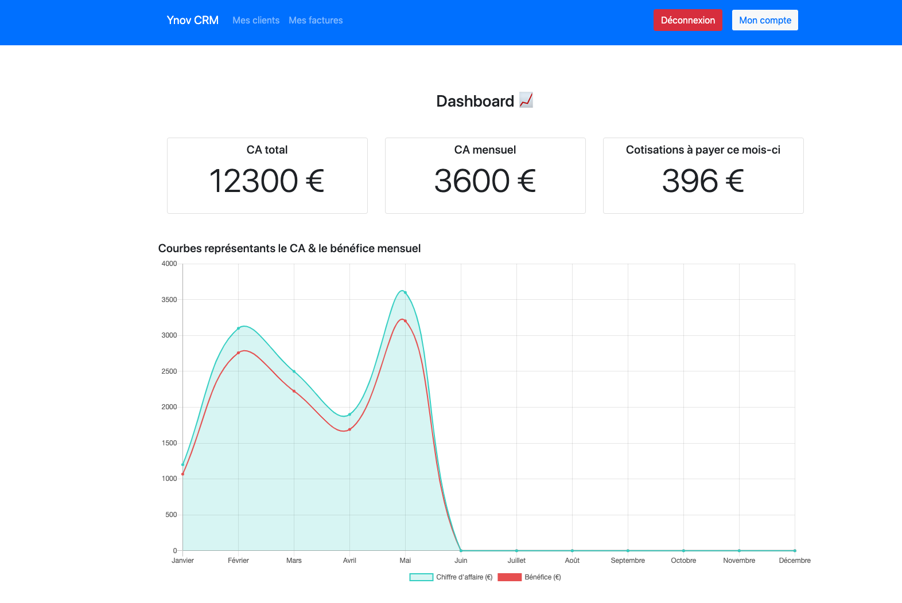
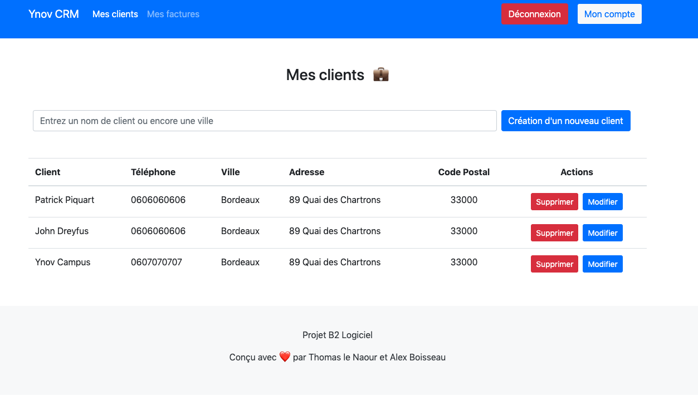
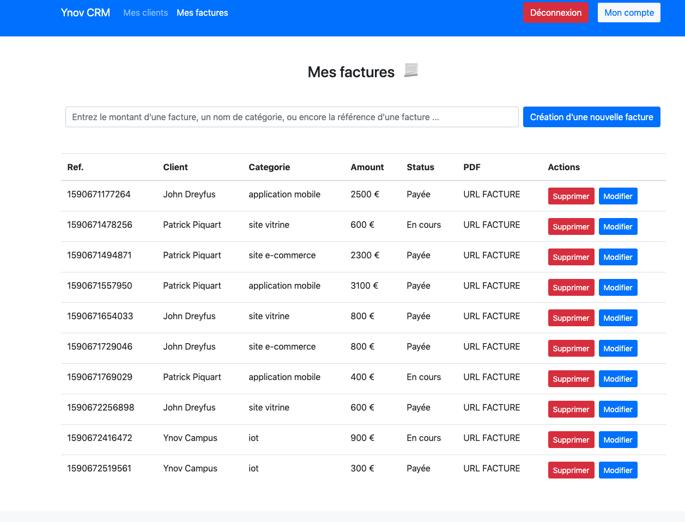

# Projet UF : Développement Logiciel

_B2A Ynov Informatique - Alex Boisseau & Thomas Le Naour_

Création d'un CRM visant à faciliter la gestion et l'analyse globale pour les freelances.

**Fonctionnalités principales :** Gestion d'un portefeuille client, gestion des factures, gestion du CA (graphiques, analyses), gestion des paramètres utilisateurs



## Stack technique

**Choix du langage :** JavaScript  
**Choix des technologies :** React.js, Electron.js, Node.js, Express.js, MongoDB

## Installation

**Prérequis :** Avoir Node.js, npm, git

- Cloner le repository

```
git clone https://github.com/tlnkorr/b2-uf-logiciel
cd b2-uf-logiciel
```

- Installation de `foreman` sur le système afin de pouvoir lancer l'application

```
npm install foreman -g
```

- Ouvrir 2 terminaux (ci-après `T1` et `T2`) et se rendre respectivement dans les dossiers `app/frontend` et `app/backend` afin d'installer les dépendances

```
# T1
cd app/frontend
npm install

# T2
cd app/backend
npm install
```

- Lancement de l'application

```
# T1 app/frontend
npm start

# T2 app/backend
npm start
```

## Utilisation

L'application se comporte de **11 pages** : accueil, connexion, inscription, dashboard, paramètres, clients, factures, création/modification de client/facture

**Vous devez impérativement être connecté pour accéder à l'application**

**Page D'accueil**

- Présentation du projet, possibilité de s'inscrire ou de se connecter

**Inscription/Connexion**

- Formulaire basique d'inscription et de connexion

**Dashboard**

- Page d'accueil principale lorsque l'utilisateur est connecté
- Visualisation des données graphiques synchronisés avec les données des factures

**Clients**

- Possibilité de voir la liste des clients, de modifier les informations, d'en créer de nouveaux ou d'en supprimer

**Factures**

- Possibilité de voir la liste des factures associées à un client, de modifier les informations, d'en créer de nouvelles ou d'en supprimer

**Paramètres**

- Possibilité de modifier les informations du compte utilisateur

## Captures d'écran




